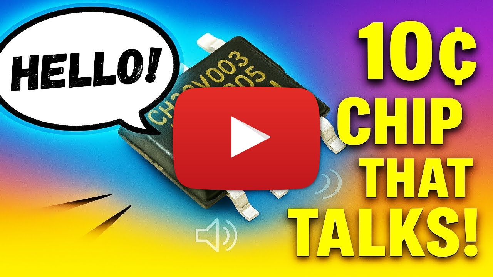

[](https://github.com/atomic14/ch32v003-music/actions/workflows/build-firmware.yml)
[](https://github.com/atomic14/ch32v003-music/actions/workflows/buzzer-studio-ci.yml)


# CH32V003J4M6 Audio Projects

A collection of audio projects for the CH32V003J4M6 RISC-V microcontroller, demonstrating various audio synthesis and playback techniques on an 8-pin, $0.10 microcontroller. From simple 1-bit music to compressed audio sample playback and speech synthesis. Click on the image to watch a video and hear the results.

[](https://www.youtube.com/watch?v=RZvX95aXSdM)

[](https://www.youtube.com/watch?v=RiiS4jjG6ME)

## Project Overview

This repository contains several firmware projects and development tools:

### Firmware Projects

1. **SimpleSoundFirmware** - Single-voice 1-bit music playback (monophonic)
2. **PolyphonicSoundFirmware** - Advanced 8-voice polyphonic music with PWM synthesis
3. **SamplePlayback** - Compressed audio sample playback (IMA ADPCM, QOA, 2-bit ADPCM)
4. **Talkie** - Speech synthesis using the Talkie library

### Development Tools

5. **Buzzer Studio** - Interactive web app for designing 1-bit sound effects and exporting MIDI tracks


The **Buzzer Studio** project is available here: https://buzzer-studio.atomic14.com/

A word of warning - the **Buzzer Studio** codebase was creating with a lot of help from AI tools. It all runs client side, there is no backend for anyone to hack. But the code may not always be easy for a human to understand.

## Quick Start

### Building the Firmware

All firmware projects build with PlatformIO. To build locally:

**Simple Sound Firmware (1-bit monophonic):**
```bash
cd SimpleSoundFirmware
pio run
```

**Polyphonic Sound Firmware (8-voice PWM):**
```bash
cd PolyphonicSoundFirmware
pio run
```

**Sample Playback (compressed audio):**
```bash
cd SamplePlayback
pio run
```

**Talkie (speech synthesis):**
```bash
cd Talkie
pio run
```

For detailed firmware information, see each project's README:
- [SimpleSoundFirmware/README.md](SimpleSoundFirmware/README.md) - Original single-voice 1-bit music
- [PolyphonicSoundFirmware/README.md](PolyphonicSoundFirmware/README.md) - 8-voice polyphonic synthesis
- [SamplePlayback/README.md](SamplePlayback/README.md) - Compressed audio playback with multiple codecs
- [Talkie/README.md](Talkie/README.md) - Speech synthesis implementation

### Converting Music Files and Creating Sound Effects

**Buzzer Studio (Web App):**
```bash
cd buzzer-studio
npm install
npm run dev
```

The app allows you to:
- Export tracks from MIDI files for 1-bit playback
- Design sound effects with real-time preview
- Export to C arrays for microcontrollers
- Export to Python for MicroPython/CircuitPython
- Choose from preset effects (jump, coin, laser, etc.)
- Play LPC encoded audio
- Encode WAV files to LPC


## Hardware Requirements

- **Microcontroller**: CH32V003J4M6 (RISC-V, 8-pin SOIC)
- **Power**: 3.3V supply
- **Programming**: WCH-Link or compatible programmer

### Pin Configurations

**SimpleSoundFirmware (1-bit music):**
- **Output**: Piezo buzzer or small speaker (connected to PD6)
- **Input**: Trigger button or signal (connected to PC1)

**PolyphonicSoundFirmware (8-voice music):**
- **Output**: Piezo buzzer or small speaker (connected to PA1)
- **No trigger input**: Plays automatically on startup

**SamplePlayback (compressed audio):**
- **Output**: PWM audio output on PA1 (8-bit via PWM)
- **No trigger input**: Plays automatically on startup

**Talkie (speech synthesis):**
- **Output**: PWM audio output on PA1 (8-bit via PWM)
- **No trigger input**: Plays speech on startup

## Project Structure

```
brain-transplant/
├── SimpleSoundFirmware/      # 1-bit monophonic music playback
│   ├── src/                  # Source code (main.cpp, music data)
│   ├── platformio.ini        # Build configuration
│   └── README.md             # Documentation
│
├── PolyphonicSoundFirmware/  # 8-voice polyphonic music
│   ├── src/                  # Source code (polyphonic player)
│   ├── platformio.ini        # Build configuration
│   └── README.md             # Documentation
│
├── SamplePlayback/           # Compressed audio sample playback
│   ├── src/                  # Source code (ADPCM decoders, PWM player)
│   │   ├── AudioStream.h     # Base interface for codecs
│   │   ├── IMAAdpcmStream.*  # IMA ADPCM decoder
│   │   ├── ADPCM2BitStream.* # 2-bit ADPCM decoder
│   │   ├── player.*          # PWM playback engine
│   │   └── audio/            # Audio data files
│   ├── platformio.ini        # Build configuration
│   └── README.md             # Documentation
│
├── Talkie/                   # Speech synthesis
│   ├── src/                  # Source code (Talkie library port)
│   │   ├── Talkie.*          # Speech synthesis engine
│   │   ├── phrases.*         # Pre-defined speech phrases
│   │   └── player.*          # Audio playback
│   ├── platformio.ini        # Build configuration
│   └── README.md             # Documentation
│
├── scripts/                  # Python audio conversion tools
│   ├── wav_to_adpcm_c.py     # WAV → ADPCM C array converter
│   ├── adpcm_2bit_decoder.py # 2-bit ADPCM decoder
│   ├── compare_audio.py      # Audio comparison tools
│   ├── pyproject.toml        # Python dependencies (uv)
│   └── README.md             # Scripts documentation
│
├── buzzer-studio/            # Interactive web app
│   ├── src/                  # TypeScript source code
│   ├── public/               # Static assets
│   ├── index.html            # App entry point
│   ├── package.json          # Dependencies and scripts
│   └── README.md             # App documentation
│
└── .github/
    └── workflows/
        ├── build-firmware.yml      # Firmware CI/CD
        └── buzzer-studio-ci.yml    # Buzzer Studio CI/CD
```

## Documentation

### Firmware Projects
- **[SimpleSoundFirmware](SimpleSoundFirmware/README.md)** - 1-bit monophonic music playback
- **[PolyphonicSoundFirmware](PolyphonicSoundFirmware/README.md)** - 8-voice polyphonic synthesis
- **[SamplePlayback](SamplePlayback/README.md)** - Compressed audio playback with multiple codec support
- **[Talkie](Talkie/README.md)** - Speech synthesis implementation

### Development Tools
- **[Buzzer Studio](buzzer-studio/)** - Web app for designing 1-bit sound effects and exporting MIDI
- **[Scripts](scripts/README.md)** - Python tools for audio conversion and ADPCM encoding

## Development

### Prerequisites

**For Firmware Development:**
- [PlatformIO](https://platformio.org/) - Embedded build system
- CH32V platform support (installed automatically by PlatformIO)
- WCH-Link programmer (or compatible)

**For Buzzer Studio App:**
- Node.js 18+ and npm
- Modern web browser with Web Audio API support

**For Python Scripts:**
- Python 3.8+
- [uv](https://github.com/astral-sh/uv) package manager

## How It Works

### Firmware Approaches

**SimpleSoundFirmware (1-bit music):**
1. Waits for trigger signal on pin PC1
2. Toggles output pin (PD6) at specified frequencies
3. Uses microsecond-precision delays for accurate timing
4. Simple 1-bit audio (square wave)

**PolyphonicSoundFirmware (8-voice music):**
1. Automatically starts on power-up
2. Manages up to 8 simultaneous voices using PWM synthesis
3. Outputs mixed audio through PA1 at 8 kHz sample rate
4. Software mixing with real-time voice generation

**SamplePlayback (compressed audio):**
1. Decodes compressed audio using codec decoders (IMA ADPCM, 2-bit ADPCM)
2. Outputs 8-bit audio via PWM on PA1 at 8 kHz
3. Supports multiple codec formats with extensible architecture
4. Compression ratios of 2:1 and 4:1

**Talkie (speech synthesis):**
1. Uses Linear Predictive Coding (LPC) for speech synthesis
2. Pre-defined vocabulary of phonemes and words
3. Outputs synthesized speech via PWM on PA1
4. Real-time speech generation from phrase data
